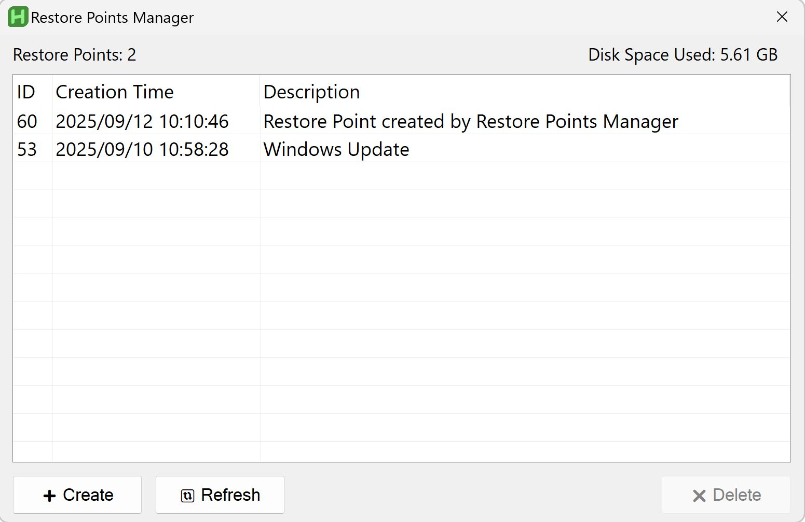

# Restore Points Manager

A Windows application built with AutoHotkey v2 that allows you to manage system restore points with a clean, user-friendly interface.

## License

This project is licensed under the MIT License.

